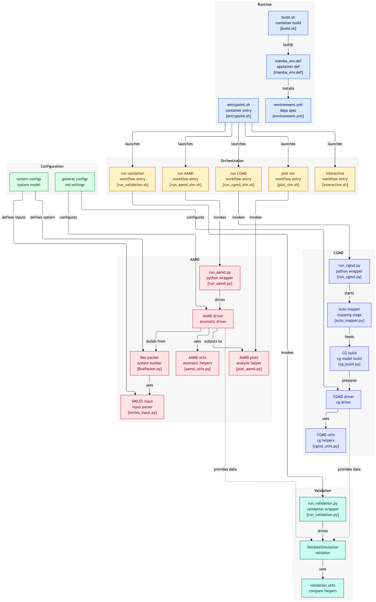

# DOW AAMD $\rightarrow$ CGMD Workflow

## Directory Map

The folder `src` contains code modules for the main workflow, while `validate` contains code specific to validation. `system_config_files` and `general_config_files` contain config files which collectively define different run configurations, and .sh files within the root folder will run various parts of the workflow. 

## Apptainer Usage and Setup

To set up the environment, on the command line first run `./build.sh` (if you get a permission denied error you may need to `chmod +x ./build.sh` first). This will take a bit of time, but only needs to be run once. You should rebuild only if the apptainer image changes. 

## Code Usage

### AAMD Simulation

To run an AAMD simulation, on the command line run the following:

`./run_aamd_sim.sh <system_config_file_name> <general_config_file_name>`

This will detect your GPU and passthrough accordingly. Note that you do not need to provide the extension or full path to the config files, just the name. 

This will write out a project folder which contains the pdb files for system components, packmol input file, combined all-atom pdb file, simulation log, all-atom radial distribution functions, and starting coarse grained pdb file. 

### CGMD Simulation

To run a CGMD simulation, on the command line run the following:

`./run_cgmd_sim.sh <system_config_file_name> <general_config_file_name>`

This relies on an all-atom simulation having already been performed for the same project. The CGMD simulation will run the minimization loop to optimize the coarse-grained parameters. The output will be a folder of simulation logs (`cg_diagnostics`), coarse-grained parameters (`cg_parameters`), and coarse-grained trajectory files (`cg_trajectories`). When the loop ends, it will write out a file with the RDF errors (`rdf_errors.csv`), final RDFs for the optimized CGMD system (`final_rdfs.csv`), and a csv file with the optimized coarse-grained parameters (`final_parameters.csv`). 

### Validation

To run validation on a completed AAMD $\rightarrow$ CGMD optimization loop, which is contained in a given project folder, run the following:

`./run_validation.sh <project_name>`

This will write out a `validation` folder to the project directory containing plots of the logged simulation quantities from the all-atom and coarse-grained simulations. It will also generate a plot detailing the evolution of the parameters and RDF error over iterations of the minimization. Additionally, it will plot the final RDFs for all-atom vs coarse-grained simulations for each combination of bead pairs. 

## Config Files

There are two configuration files required for each simulation run. The system config file defines parameters relevant to a given system and simulation. The general config file includes parameters related to how openMM performs its molecular dynamics simulations. The following sections describe the parameters contained in each config file. 

### System Config

* `project name`
    * **Meaning** : Name of the project corresponding to this system. Running a simulation will create a folder with the same name as the project. All results will be output to this folder.  
* `solvents`
    * **Meaning** : SMILES string(s), separated by spaces, corresponding to the solvent compound(s) in the system. 
    * **Options** :
        * O (Water)
        * CCCCCCCCCCCC (Dodecane)
        * OCCCCCCCC (1-octanol)
* `number of solvent molecules`
    * **Meaning** : Integer numbers, separated by spaces, corresponding to how many of each solvent compound(s) the system contains. 
* `density of solvents`
    * **Meaning** : Float numbers, separated by spaces, corresponding to the density of each solvent in $g/cm^3$
* `compounds of interest`
    * **Meaning** : SMILES string(s), separated by spaces, corresponding to the compound(s) of interest in the system. 
    * **Options** :
        * OCCOCCOCCOCCCCCCCCC (C9E3, triethylene glycol monononyl ether)
        * OCCOCCOCCCCCC (C6E2, tiethylene glycol monohexyl ether)
        * O1CCOCC1 (1,4-dioxane)
* `number of COI molecules`
    * **Meaning** : Integer numbers, separated by spaces, corresponding to the number of each compound of interest the system contains. 
* `density of COI`
    * **Meaning** : Float numbers, separated by spaces, corresponding to density of COI molecule(s) in $g/cm^3$. 
* `mixture type`
    * **Meaning** : Mixture type of the system, i.e. how a two-phase system is integrated. 
    * **Options** :
        * 0 : Fully mixed
        * 1 : Separated
        * 2 : COI dissolved into specified solvent
* `temperature`
    * **Meaning** : Temperature of the system, in Kelvin. 
* `pressure`
    * **Meaning** : Pressure of the system, in bars. Only used for NPT simulations. 
*  `simulation type`
    * **Meaning** : Statistical ensemble type of the simulation, defines which parameters are held constant.  
    * **Options** :
        * NVT : constant number, volume, temperature
        * NPT : constant number, pressure, temperature

### General Config

* `forcefield`
    * **Meaning** : Type of forecefield used for openMM all-atom molecular dynamics, defines the physics of how particles interact. 
    * **Options** : 
        * openff
        * amber
* `water model`
    * **Meaning** : Whether to explicitly use a water specific forcefield for a system containing water, and which model to use. 
    * **Options** : 
        * None
        * tip3
        * tip4
* `LJ interaction cutoff`
    * **Meaning** : Cutoff radius (in nm) past which Lennard Jones interaction potential is not calculated. 
    * **Default** : 1 nm
* `periodic box margin`
    * **Meaning** : Margin (percentage) past the initial packed box dimensions which will represent the periodic boundary cutoff. 
    * **Default** : 0
* `cg forcefield`
    * **Meaning** : Form of forcefield to use for coarse-grained molecular dynamics potential. 
    * **Options** : 
        * srel
        * boltzmann
* `default parameter(s)`
    * **Meaning** : Default initial values of parameters to use for the coarse-grained forcefield optimization (number of parameters depends on method). 
* `cg interaction cutoff`
    * **Meaning** : Cutoff radius (in nm) past which the coarse-grained interaction potential is not calculated.
    * **Default** : 1.55 nm
* `aa / cg friction`
    * **Meaning** : Defines how strongly the system is coupled to its "heat bath", i.e. how tightly the temperature is regulated. 
    * **Default** : 1 picoseconds $^{-1}$
* `aa / cg integration timestep`
    * **Meaning** : Time step (in femtoseconds) at which molecular dynamics forces are recomputed and the system state is advanced. 
    * **Default** : 2 femtoseconds
* `aa / cg equilibration time`
    * **Meaning** : Time (in nanoseconds) that the system will spend equilibrating prior to the production run.
    * **Default** : 0.5 nanoseconds
* `aa / cg production time`
    * **Meaning** : Time (in nanoseconds) that the system will run production for. Only this portion of the simulation is used collect statistics for AA-CG comparisons.
    * **Default** : 1 nanosecond
* `aa / cg trajectory log frequency`
    * **Meaning** : How frequently (in nanoseconds) the system state is logged to the trajectory file. 
    * **Default** : 0.001 nanoseconds
* `aa / cg pressure enforcing frequency`
    * **Meaning** : How frequently (in nanoseconds) the simulation will enforce the barostat pressure. Only relevant for NPT simulations. 
    * **Default** : 0.00005 nanoseconds